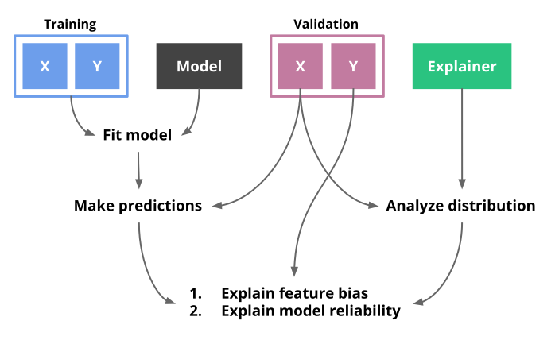
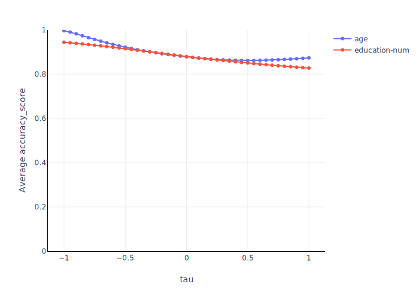
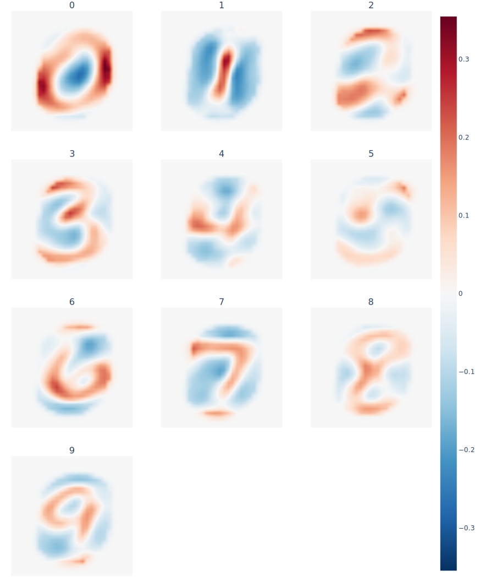

<div align="center">
  <h1>ethik</h1>
</div>

<div align="center">
  <!-- Travis -->
  <a href="https://travis-ci.org/XAI-ANITI/ethik">
    
  </a>
  <!-- PyPI -->
  <a href="https://pypi.org/project/ethik">
    
  </a>
  <!-- Black -->
  <a href="https://github.com/psf/black">
    
  </a>
  <!-- License -->
  <a href="https://www.gnu.org/licenses/gpl-3.0.en.html">
    
  </a>
</div>

## Table of contents

* [Introduction](#introduction)
* [Installation](#installation)
* [User guide](#user-guide)
    * [Measuring model influence](#measuring-model-influence)
    * [Evaluating model reliability](#evaluating-model-reliability)
    * [Support for image classification](#support-for-image-classification)
* [Authors](#authors)
* [License](#license)

**The documentation can be found [here](https://xai-aniti.github.io/ethik/)**.

## Introduction

`ethik` is a Python package for performing [fair](https://perso.math.univ-toulouse.fr/loubes/fairness-robustness-in-machine-learning/) and [explainable](https://www.wikiwand.com/en/Explainable_artificial_intelligence) machine learning. At it's core, the approach of `ethik` is to build *counterfactual distributions* that permit answering "what if?" scenarios. The idea is that we are able to stress one or more variables and observe how a machine learning model reacts to the stress. The stress is based on a statistical re-weighting scheme called *entropic variable projection*. The main benefit of our method is that it will only consider realistic scenarios, and will not build fake examples. You may find more information by reading [this paper](https://arxiv.org/abs/1810.07924) as well as the ["How It Works" notebook](notebooks/how-it-works.ipynb).

<div align="center">
  
</div>

Currently, `ethik` can be used for:

1. Detecting model influence with respect to one or more (protected) attributes.
2. Identifying causes for why a model performs poorly on certain inputs.
3. Visualizing regions of an image that influence a model's predictions.

We have more plans for the future.

## Installation

:warning: Python 3.6 or above is required :snake:

**Via [PyPI](https://pypi.org/project/ethik/)**

```shell
>>> pip install ethik
```

**Via GitHub for the latest development version**

```shell
>>> pip install git+https://github.com/XAI-ANITI/ethik
>>> # Or through SSH:
>>> pip install git+ssh://git@github.com/XAI-ANITI/ethik.git
```

**Development installation**

```shell
>>> git clone git@github.com:XAI-ANITI/ethik.git
>>> cd ethik
>>> make install_dev
```

## User guide

:point_up: Please check out [this notebook](notebooks/binary-classification.ipynb) for more detailed code.

In the following example we'll be using the ["Adult" dataset](https://archive.ics.uci.edu/ml/datasets/adult). This dataset contains a binary label indicating if a person's annual income is larger than $50k. `ethik` can diagnose a model by looking at the predictions the model makes on a test set. Consequently, you first have to split your dataset in two (train and test).

```python
from sklearn import model_selection

X_train, X_test, y_train, y_test = model_selection.train_test_split(X, y, shuffle=True, random_state=42)
```

You then want to train your model on the training set and make predictions on the test set. In this example we'll train a gradient boosting classifier from the [LightGBM library](https://lightgbm.readthedocs.io/en/latest/). We'll use a variable named `y_pred` to store the predicted probabilities associated with the `True` label.

```python
import lightgbm as lgb

model = lgb.LGBMClassifier(random_state=42).fit(X_train, y_train)

# We use a named pandas series to make plot labels more explicit
y_pred = model.predict_proba(X_test)[:, 1]
y_pred = pd.Series(y_pred, name='>$50k')
```

We can now initialize an `ClassificationExplainer` using the default parameters.

```python
import ethik

explainer = ethik.ClassificationExplainer()
```

### Measuring model influence

`ethik` can be used to understand how the model predictions vary as a function of one or more features. For example we can look at how the model behaves with respect to the `age` feature.

```python
explainer.plot_influence(X_test=X_test['age'], y_pred=y_pred)
```

<div align="center">
  
</div>

Recall that the target indicates if a person's annual salary is above $50k. **We can see that the model predicts higher probabilities for older people**. This isn't a surprising result, and could have just as well been observed by looking at the data. However, we can see that the predictions plateau at around 50 years old. Indeed, although salary is correlated with age, some people may retire early or lose their job. Furthermore we can see that the model understands the fact that salaries shrink once people get in age of retiring. This up-and-down relationship is in nature non-linear, and isn't picked up by summary statistics such as correlation coefficients, [odds ratios](https://www.wikiwand.com/en/Odds_ratio), and feature importances in general. Although the observations we made are quite obvious and rather intuitive, it's always good to confirm what the model is thinking. The point is that the curves produced by `plot_predictions` represent the relationship between a variable and the target according to the model, rather than the data.

We can also plot the distribution of predictions for more than one variable. However, because different variables have different scales we have to use a common measure to display them together. For this purpose we plot the τ ("tau") values. These values are contained between -1 and 1 and simply reflect by how much the variable is shifted from it's mean towards it's lower and upper quantiles. In the following figure a tau value of -1 corresponds to just under 20 years old whereas a tau value of 1 refers to being slightly over 60 years old.

```python
explainer.plot_influence(X_test=X_test[['age', 'education-num']], y_pred=y_pred)
```

<div align="center">
  
</div>

We can observe that the model assigns higher probabilities to people with higher degrees, which makes perfect sense. Again, this conveys much more of a story than summary statistics.

### Evaluating model reliability

Our methodology can also be used to evaluate the reliability of a model under different scenarios. Evaluation metrics that are commonly used in machine learning only tell you part of the story. Indeed they tell you the performance of a model *on average*. A more interesting approach is to visualize how accurate the model is with respect to the distribution of a variable.

```python
explainer.plot_performance(
    X_test=X_test['age'],
    y_test=y_test,
    y_pred=y_pred > 0.5,  # metrics.accuracy_score requires y_pred to be binary
    metric=metrics.accuracy_score
)
```

<div align="center">
  
</div>

In the above figure **we can see that the model is more reliable for younger people than for older ones**. Having a fine-grained understanding of the accuracy of a model can be of extreme help in real-life scenarios. Indeed this can help you understand where the error of the model is coming from and guide your data science process.

Similarly to the `plot_predictions` method, we can display the performance of the model for multiple variables.

```python
explainer.plot_performance(
    X_test=X_test[['age', 'education-num']],
    y_test=y_test,
    y_pred=y_pred > 0.5,
    metric=metrics.accuracy_score
)
```

<div align="center">
  
</div>

### Support for image classification

A special class named `ImageClassificationExplainer` can be used to analyze image classification models. It has the same API as `ClassificationExplainer`, but expects to be provided with an array of images. For instance, we can analyze a CNN run on the MNIST dataset [from the Keras documendation](https://keras.io/examples/mnist_cnn/). The model achieves an accuracy of around 99% on the test set. For the sake of brevity we will the skip the exact details of the model training.

```python
(x_train, y_train), (x_test, y_test) = mnist.load_data()

cnn.fit(x_train, y_train)
y_pred = cnn.predict_proba(x_test)
```

`x_test` is a set of images of shape `(10000, 28, 28)` whilst `y_pred` is a set of probabilities predicted for digit by the CNN, and is thus of shape `(10000, 10)`. We can use the `plot_influence` method to display the importance of each pixel for the classifier with respect to each label.

```python
import ethik

explainer = ethik.ImageClassificationExplainer()
explainer.plot_influence(x_test, y_pred)
```

<div align="center">
  
</div>

This takes around 15 seconds to run on a mid-tier laptop. The previous plot highlights the regions of importance for identifying each digit. More precisely, the intensity of each pixel corresponds to the probability increase of saturating or not the pixel. A value of 0.28 means that saturating the pixel increases the probability predicted by the model by 0.28. Note that we do not saturate and desaturate the pixels independently. Instead, our method understands which pixels are linked together and saturates them in a realistic manner. The previous images show that the CNN seems to be using the same visual cues as a human. However, we can see that is uses very specific regions on images to identify particular digits. For instance, the top-right region of an image seems to trigger the "5" digit, whereas the bottom parts of the images seem to be linked with the "7" digit. Meanwhile, the colder areas correspond to regions that lower the predicted probabilities when the corresponding pixels are "turned on", which is why the center of the "0" digit figure is blue.

## Authors

This work is led by members of the [Toulouse Institute of Mathematics](https://www.math.univ-toulouse.fr/?lang=en), namely:

- [François Bachoc](https://www.math.univ-toulouse.fr/~fbachoc/)
- [Fabrice Gamboa](https://www.math.univ-toulouse.fr/~gamboa/newwab/Pages_Fabrice_Gamboa/Main_Page.html)
- [Max Halford](https://maxhalford.github.io/)
- [Vincent Lefoulon](https://vayel.github.io/)
- [Jean-Michel Loubes](https://perso.math.univ-toulouse.fr/loubes/)
- [Laurent Risser](http://laurent.risser.free.fr/menuEng.html)

You can contact us at [jm.loubes@gmail.com](mailto:jm.loubes@gmail.com) and/or [maxhalford25@gmail.com](mailto:maxhalford25@gmail.com).

This work is supported by the [Centre National de la Recherche Scientifique (CNRS)](http://www.cnrs.fr/) and is done in the context of the [Artificial and Natural Intelligence Toulouse Institute (ANITI)](https://en.univ-toulouse.fr/aniti) project.

## License

This software is released under the [GPL license](LICENSE).
