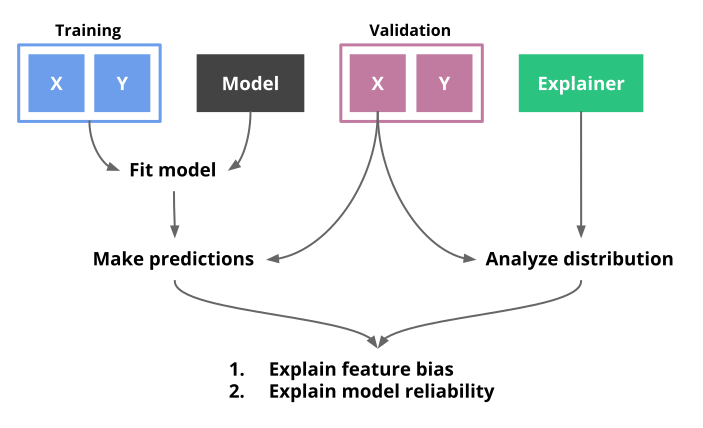
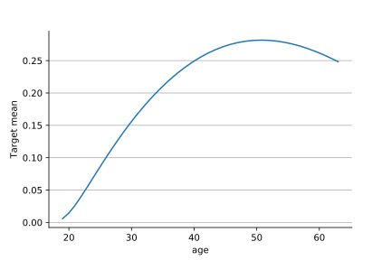
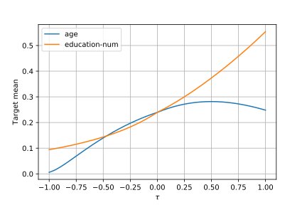
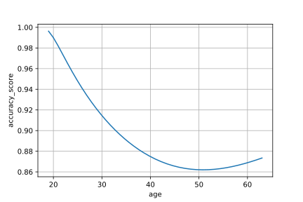
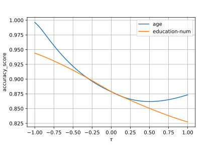

# Ethik

* [Introduction](#introduction)
* [Installation](#installation)
* [User guide](#user-guide)
    * [Measuring model bias](#measuring-model-bias)
    * [Evaluating model reliability](#evaluating-model-reliability)
    * [Handling images](#handling-images)
* [API](#api)
* [Authors](#authors)
* [License](#license)

## Introduction

Ethik is a Python package for performing [fair](https://www.microsoft.com/en-us/research/blog/machine-learning-for-fair-decisions/) and [explainable](https://www.wikiwand.com/en/Explainable_artificial_intelligence) machine learning.

<div align="center">
  
</div>

## Installation

:warning: Python 3.6 or above is required :snake:

**Via [PyPI](https://pypi.org/project/ethik/)**

```shell
>>> pip install ethik
```

**Via GitHub for the latest development version**

```shell
>>> pip install git+https://github.com/MaxHalford/ethik
```

## User guide

:point-up: For more detailed code please see [this notebook](notebooks/Adult.ipynb)

In the following example we'll be using the ["Adult" dataset](https://archive.ics.uci.edu/ml/datasets/adult). This dataset contains a binary label indicating if a person's annual income is larger than $50k per year. `ethik` analyzes a model based on the predictions it makes on a test set. Consequently you first have to split your dataset in two.

```python
from sklearn import model_selection

X_train, X_test, y_train, y_test = model_selection.train_test_split(X, y, shuffle=True, random_state=42)
```

You then want to train your model on the training set and make predictions on the test set. For this example we'll train a gradient boosting classifier from the [LightGBM library](https://lightgbm.readthedocs.io/en/latest/). We'll use a variable named `y_pred` to store the predicted probabilities associated with the `True` label.

```python
import lightgbm as lgb

model = lgb.LGBMClassifier(random_state=42).fit(X_train, y_train)

y_pred = model.predict_proba(X_test)[:, 1]
```

We can now fit an `Explainer` using the features from the test set. This will analyze the distribution of each feature and build a set of `lambda` coefficients which can be used to explain model predictions.

```python
import ethik

explainer = ethik.Explainer()
explainer = explainer.fit(X_test)
```

### Measuring model bias

`ethik` can be used to understand how model predictions vary as a function of one or more features. For example we may want the model predicts with respect to the `age` feature.

```python
explainer.plot_predictions(X=X_test['age'], y_pred=y_pred)
```

<div align="center">
    
</div>

Recall that the target indicates if a person's salary is above $50k. **We can see that the model predicts higher probabilities for older people**. This isn't a surprising result, and could have just as well been observed during exploratory data analysis. However, we can see that the predictions plateau at around 50 years old. Indeed, although salary is correlated with age, some people may retire early or lose their job. Furthermore we can see that the model understands the fact that salaries shrink once people get in age of retiring. This up-and-down relationship is in nature non-linear, and isn't picked up by summary statistics such as correlation coefficients, [odds ratios](https://www.wikiwand.com/en/Odds_ratio), and feature importances in general. Although the observations we made are quite obvious and rather intuitive, it's always good to confirm what the model is thinking. The point is that the curves produced by `plot_predictions` represent the relationship between a variable and the target according to the model, rather than the data.

We can also plot the distribution of predictions for more than one variable. However, because different variables have different scales we have to use a common measure to display them together. For this purpose we plot the τ ("tau") values. These values are contained between -1 and 1 and simply reflect by how much the variable is shifted from it's mean towards it's lower and upper quantiles. In the following figure a tau value of -1 corresponds to just under 20 years old whereas a tau value of 1 refers to being slightly over 60 years old.

```python
explainer.plot_predictions(X=X_test['age', 'education-num'], y_pred=y_pred)
```

<div align="center">
    
</div>

We can observe that the model assigns higher probabilities to people with higher degrees, which makes perfect sense. Again, this conveys much more of a story than summary statistics.

### Evaluating model reliability

Our methodology can also be used to evaluate the reliability of a model under different scenarios. What you have to understand is that evaluation metrics commonly used in machine learning only tell you part of the story. Indeed they tell you the performance of a model *on average*. A more interesting approach is to visualize how accurate the model is with respect to the distribution of a variable.

```python
explainer.plot_metric(
    X=X_test['age'],
    y=y_test,
    y_pred=y_pred > 0.5,
    metric=metrics.accuracy_score
)
```

<div align="center">
    
</div>

In the above figure **we can see that the model is more reliable for younger people than for older ones**. Having a fine-grained understanding of the accuracy of a model can be of extreme help in real-life scenarios. Moreover this can help you understand from where the error of the model is coming from and guide your data science process.

Similarly to the `plot_predictions` method, we can display the performance of the model for multiple variables.

```python
explainer.plot_metric(
    X=X_test['age', 'education-num'],
    y=y_test,
    y_pred=y_pred > 0.5,
    metric=metrics.accuracy_score
)
```

<div align="center">
    
</div>

### Handling images

A special class named `ImageExplainer` can be used to analyze image classification models. It has the same API as `Explainer` but expects to be provided with an array of images. For example we can analyze a CNN run on the MNIST dataset [from the Keras documendation](https://keras.io/examples/mnist_cnn/). The model achieves an accuracy of around 99% on the test set.

We'll first produce predictions for the test set. `x_test` is expected to be an array of shape (`n_images`, `width`, `height`, `n_channels`). Because we are using the MNIST dataset, `x_test` is an array of shape `(10000, 28, 28, 1)`.

```python
y_pred = model.predict_proba(x_test)
```

We will now fit an `ImageExplainer` to analyze the images in parallel using `n_jobs=-1`.

```python
import ethik

explainer = ethik.ImageExplainer(n_jobs=-1)
explainer = explainer.fit(x_test)
```


## API


## Authors

This work is led by researchers from the [Toulouse Institute of Mathematics](https://www.math.univ-toulouse.fr/?lang=en), namely:

- [François Bachoc](https://www.math.univ-toulouse.fr/~fbachoc/)
- [Fabrice Gamboa](https://www.math.univ-toulouse.fr/~gamboa/newwab/Pages_Fabrice_Gamboa/Main_Page.html)
- [Max Halford](https://maxhalford.github.io/)
- [Jean-Michel Loubes](https://perso.math.univ-toulouse.fr/loubes/)
- [Laurent Risser](http://laurent.risser.free.fr/menuEng.html)

## License

[MIT license](LICENSE)
